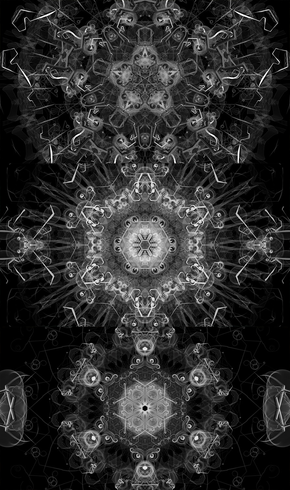

# Mandala

Proyecto originalmente realizado en Processing y posteriormente traducido a JS a travez de P5.

## Descripción

Consiste en un sistema de partículas que genera patrones circulares basados en un comportameinto Caleidoscopio. Las diviciones radiales del patrón dependen en una primera instanción de un número aleatorio, y a partir de esta estructura general se hacen subdivisiones en dos niveles más.

